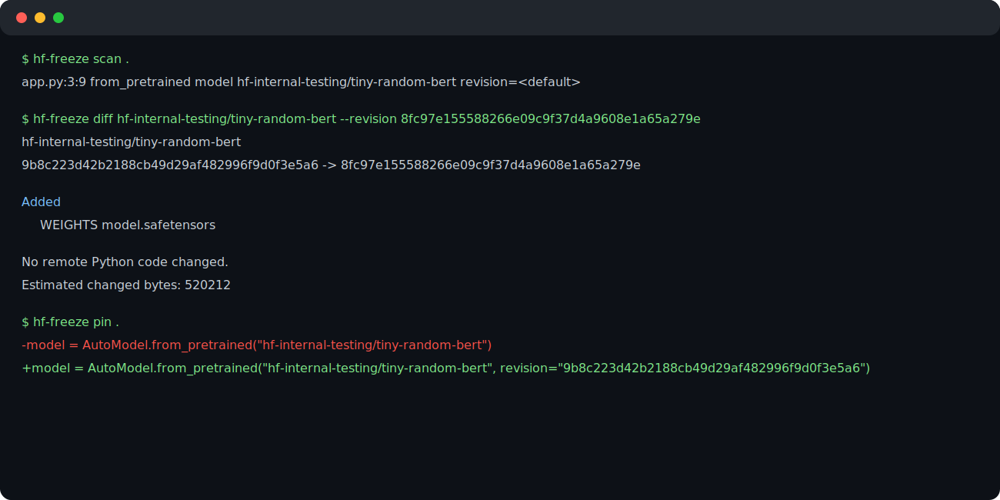

# hf-freeze

`hf-freeze` is a local Python CLI for the gap between a package lockfile and a
Hugging Face Hub call such as `AutoModel.from_pretrained("org/model")`. It finds
supported literal references, resolves a moving revision to an immutable commit,
writes a deterministic `hf.lock`, and helps you review and apply exact source
pins. That makes the Hub snapshot your project expects visible and reviewable in
Git—without running your project or downloading model weights to create the lock.

## Install

Python 3.10+ is required.

Install directly from GitHub with [uv](https://docs.astral.sh/uv/):

```bash
uv tool install git+https://github.com/DBordeleau/hf-freeze.git
```

Or install from a source checkout:

```bash
git clone https://github.com/DBordeleau/hf-freeze.git
cd hf-freeze
uv tool install .
```

## From source to `hf.lock`

Run these commands at the root of the Python project whose Hub calls you want to
track:

```bash
hf-freeze scan
hf-freeze lock
hf-freeze pin
hf-freeze pin --write
hf-freeze check --frozen
```

`scan` shows supported findings and unresolved dynamic values. `lock` resolves
the current requested revisions and writes deterministic JSON to `hf.lock`.
`pin` previews the minimal source changes needed to add those exact
`revision=` values; review that dry-run diff before explicitly applying it with
`hf-freeze pin --write`. `check --frozen` is the offline CI guard that succeeds
when supported calls are covered by matching immutable source and lock SHAs.

## Commands and safety

| Command | Purpose | Network |
| --- | --- | --- |
| `hf-freeze scan [PATH]` | Statically discover supported Python calls. | No |
| `hf-freeze lock [PATH]` | Resolve known revisions and atomically write `hf.lock`. | Hub metadata only; no weights |
| `hf-freeze check [PATH] --frozen` | Check source/lock coverage for CI. | No |
| `hf-freeze diff REPO_ID [--revision REV]` | Compare the locked SHA to a candidate revision. | Hub metadata; only allowlisted small JSON files may be read for semantic comparison |
| `hf-freeze pin [PATH] [--write]` | Preview, then optionally atomically apply, exact source pins. | No |

`scan` succeeds when it can report findings, including unresolved ones. `lock`
refuses to write when supported findings are unresolved or conflict. `check
--frozen` and a `pin` run with skipped unsafe targets exit nonzero so CI cannot
mistake incomplete coverage for success. `diff` reports changes as information;
repository, lockfile, or Hub errors are failures. `pin` is dry-run by default and
does not edit files unless `--write` is explicit.

There is no `update` command.

### Supported call shapes

The prototype recognizes literal strings and simple same-scope string constants
in these forms:

- `*.from_pretrained("repo/id", ...)` (including common Diffusers forms)
- `load_dataset("repo/id", ...)`
- `hf_hub_download(repo_id="repo/id", ...)`
- `snapshot_download(repo_id="repo/id", ...)`
- `SentenceTransformer("repo/id", ...)`
- `PeftModel.from_pretrained(base_model, "repo/id", ...)` or `model_id=`
- `pipeline(..., model="repo/id", ...)`

It scans source; it does not import or execute your project. Dynamic IDs,
interpolated strings, imported configuration, and unsupported pipeline forms are
reported rather than resolved silently.

## Immutable demo: tiny-random-bert

[`examples/tiny-random-bert`](examples/tiny-random-bert) is a real, intentionally
floating call site. Its committed `hf.lock` records the historical Hub commit
`9b8c223d42b2188cb49d29af482996f9d0f3e5a6`; that mismatch is deliberate until
you apply the preview from `pin`.

```bash
cd examples/tiny-random-bert
hf-freeze scan .
hf-freeze diff hf-internal-testing/tiny-random-bert --revision 8fc97e155588266e09c9f37d4a9608e1a65a279e
hf-freeze pin .
```

The exact revision comparison is reproducible: metadata reports the candidate's
added `model.safetensors` weight artifact (520,212 bytes). It does not execute a
model or download the weight/artifact. Because the source intentionally floats,
`hf-freeze check . --frozen` is expected to fail until the reviewed pin is
applied; do not commit the example after applying that preview.



## Limitations

- Discovery is static, Python-only, and intentionally incomplete; it is not a
  behavioral or security analysis.
- It does not provide complete transitive dependency discovery, notebook support,
  a strict file manifest, artifact mirroring, or runtime enforcement.
- Metadata operations avoid weight downloads. `diff` may read only an allowlisted
  small configuration JSON file when it needs a bounded semantic comparison.
- A pinned Hub commit identifies a snapshot, but this prototype does not claim
  broad library compatibility, model quality, security, or future Hub retention.

## Contributing and license

See [CONTRIBUTING.md](CONTRIBUTING.md). Licensed under [Apache-2.0](LICENSE).
